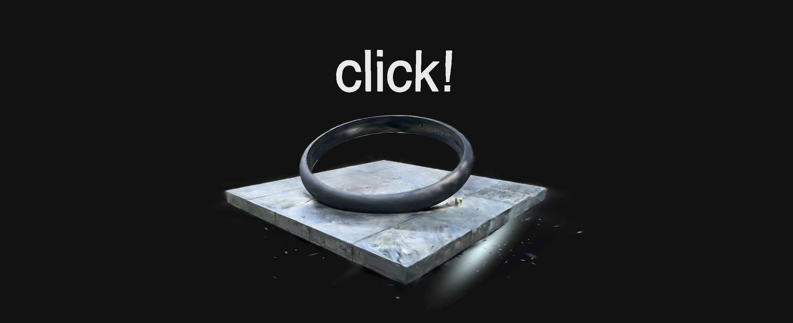

# [](https://lumalabs.ai) S.O.S (Sounds Of Smog)

`S.O.S` is an interactive web page based on the browser that can be explored in VR headset. 
It features three distinct scenes representing varying levels of smog concentration, each accompanied by corresponding music. The smog density in the scenes dynamically changes in real-time based on the pitch of the music, resulting in different immersive experiences.

### CONCEPT
random, sustainability, Smog (PM2.5)

### USER CASE
Each time the viewer clicks on the portal, the viewer is randomly introduced to a different level of air pollution and heard a soundscape that matches.


**view my code on github! [ GitHub repo](https://github.com/Druidss/SOS)** 


### Contents

- [wilderness](#wildness)
- [polluted metropolis](#metropolis)
- [construction](#construction)


## Getting Started
[](#getting-started)

`source` can be either of:
- URL to a capture on [lumalabs.ai](https://lumalabs.ai)
- path to a luma splats file or folder containing a luma splats artifacts


## Metropolis
[](#metropolis)

 polluted metropolis with the prompt on Musicgen 
 
 ```t
 `Muffled Lament vibe`, `sad`, `Gloomy Desolation`, `orchestral Cello`,
`Bassoon, Organ`, `Choir`, `Muted melody`,
`Endlessness` 
```

```ts
let splats = new LumaSplatsThree({
 // Wells Fargo Center, Denver CO @VibrantNebula_Luma
 source: 'https://lumalabs.ai/capture/d73e294a-b07a-4e97-b84b-8da3bb34ab5c',
});

scene.add(splats);

scene.add(createText());
```


## construction
[](#construction)

Construction Site  with the prompt on Musicgen 
```t
`Toxic Elegy vibe`, `melancholic`, `Asphalt Lamentation`,
 `Synth Clouds`, `Bassoon Drone`, `Percussive Echoes`, `Choir of Industry`, `Muted Sorrow`.
```


```ts
let splats = new LumaSplatsThree({
 // Construction Site @VibrantNebula_Luma 
 source: 'https://lumalabs.ai/capture/bb063183-310e-4dc9-abbe-ce521f38f228',
});

scene.add(splats);

scene.add(createText());
```


## wildness
[](#wildness)


wildness with the prompt on Musicgen
```t
 `Sylvan Serenade vibe`, `peaceful`, `Sunrise Sonata`, `Guitar`,
  `Bassoon`, `Harmonic Birdsong`, `Woodland Choir`, 
	`Gentle Resonance`, `Infinite Harmony`.
 ```


```ts
let splats = new LumaSplatsThree({
 // HOLLYWOOD @DroneFotoBooth
 source: 'https://lumalabs.ai/capture/b5faf515-7932-4000-ab23-959fc43f0d94',
});

scene.add(splats);

scene.add(createText());
```
